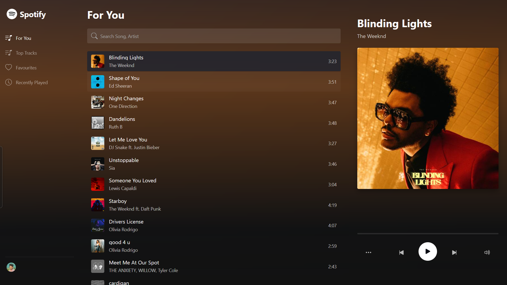

<div align="center">

# 🎵 MELODIFY 🎵

### A Modern Spotify Clone Experience

<br>

# [🔴 LIVE DEMO](https://spotify-clone-1-sai.vercel.app/)

<br>



</div>

## 🚀 About Melodify

Melodify is a cutting-edge music streaming platform built with React, TypeScript, and SCSS that delivers an immersive listening experience with advanced playback features and a sleek, intuitive interface inspired by Spotify.

## ✨ Key Features

- **Seamless Playback** - Full-featured music player with progress tracking and audio visualization
- **Dynamic Theming** - Intelligent background adaptation based on album artwork 
- **User Preferences** - Persistent storage for user favorites and listening history
- **Advanced Search** - Robust search functionality for songs, artists, and playlists
- **Responsive Design** - Optimized interface for all devices from mobile to desktop
- **Performance Optimized** - Efficient resource management for smooth playback

## 🛠️ Technology Stack

- React 18
- TypeScript
- SCSS/Sass
- React Bootstrap
- React Icons

## 📋 Requirements

- Node.js (v14+)
- npm (v6+)

## 🏁 Getting Started

### Installation

```bash
# Clone the repository
git clone https://github.com/sainath-666/spotify_clone1

# Navigate to project directory
cd spotify_clone1

# Install dependencies
npm install
```

### Development

```bash
# Start development server
npm start
```

Access the application at `http://localhost:3000`

### Production Build

```bash
# Create optimized production build
npm run build
```

## 🏗️ Architecture

```
src/
├── components/         # Reusable UI components
│   ├── Player.tsx     # Audio playback interface
│   ├── Sidebar.tsx    # Navigation component
│   └── SongList.tsx   # Track listing component
├── data/              # Data management
│   └── songs.ts       # Song information
├── hooks/             # Custom React hooks
│   └── useBackgroundColor.ts
├── styles/            # SCSS stylesheets
│   └── main.scss      # Global styles
└── App.tsx           # Application entry point
```

## 💡 Technical Implementation

### Adaptive UI Theming

The application analyzes dominant colors from album artwork to create dynamic background gradients that complement each track, implemented through a custom `useBackgroundColor` hook.

### State Management

- **Persistent Storage** - User favorites stored in localStorage for cross-session persistence
- **Session Management** - Recently played tracks tracked in sessionStorage
- **React Hooks** - Efficient state management with useState and useEffect

### Responsive Architecture

The interface intelligently adapts to viewport dimensions:

- **Desktop** - Expanded layout with full navigation and content visibility
- **Tablet** - Optimized spacing with maintained functionality
- **Mobile** - Condensed interface focusing on playback controls

### Performance Optimizations

- Color transition animations with hardware acceleration
- Lazy-loaded components for improved initial load time
- Optimized asset delivery and caching
  

## 🤝 Contributing

We welcome contributions to enhance Melodify:

1. Fork the repository
2. Create a feature branch (`git checkout -b feature/amazing-feature`)
3. Commit changes with descriptive messages (`git commit -m 'Add: implement amazing feature'`)
4. Push to your branch (`git push origin feature/amazing-feature`)
5. Open a Pull Request with detailed description

## 📄 License

This project is licensed under the MIT License - see the LICENSE file for details.

## 📱 Connect With Me

[](https://www.linkedin.com/in/sainath666)

---

<div align="center">
  <p>Made with ❤️ by Sainathreddy</p>
</div>
